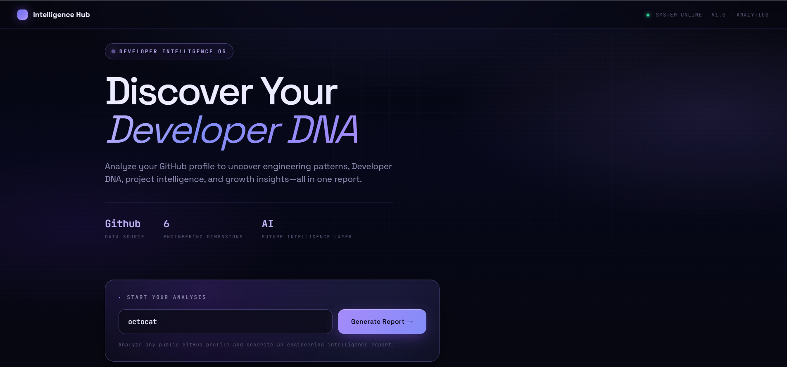
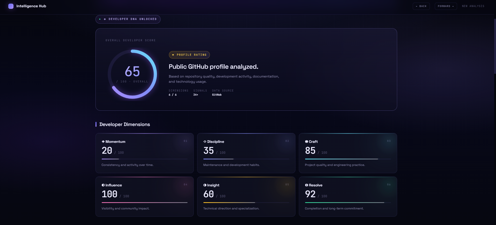
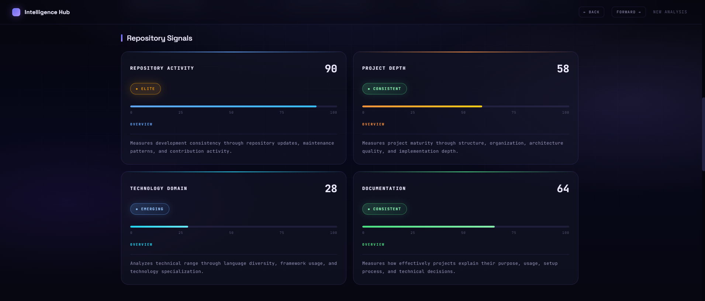

# Intelligence Hub

A GitHub-based developer intelligence platform that analyzes public GitHub activity and generates an evidence-based developer profile.

Intelligence Hub collects real GitHub data such as repositories, programming languages, activity patterns, documentation signals, and project information to create insights about a developer's public development patterns.

The goal is not to judge programming ability, but to visualize measurable signals from a developer's GitHub presence.

---

# Screenshots

## Intelligence Hub Home



## Developer Profile Analysis



## Repository Intelligence



---

# Features

## GitHub Profile Analysis

Fetches and analyzes developer information using GitHub REST API.

Includes:

- Public profile information
- Repository data
- Programming language usage
- Stars and forks
- Repository activity
- Development signals

---

# Developer Snapshot

Generates a developer overview based on collected GitHub evidence.

Provides:

- Total repositories
- Original projects
- Stars received
- Fork activity
- Language distribution
- Technology footprint
- Development patterns

---

# Repository Intelligence

Analyzes repositories using available GitHub information.

Signals include:

- Repository metadata
- Description quality
- README availability
- Topics
- Programming languages
- Stars and forks
- Repository activity

---

# Developer DNA Analysis

Intelligence Hub creates an experimental developer profile based on GitHub signals.

The system evaluates six dimensions:

### Momentum

Measures development consistency through activity patterns and repository updates.

### Discipline

Measures maintenance habits and repository organization signals.

### Craft

Measures project quality indicators such as structure, documentation, and engineering practices.

### Influence

Measures public visibility through community signals like followers, stars, and forks.

### Insight

Measures technical direction through language usage and technology specialization.

### Resolve

Measures completion patterns and long-term project commitment.

> Developer DNA is an experimental visualization system based only on available GitHub evidence. It does not represent complete programming ability.

---

# Repository Explorer

Explore analyzed repositories through:

- Repository cards
- Language information
- Stars and forks
- Repository links
- Search and filtering
- Sorting options

---

# Tech Stack

## Backend

- Python
- FastAPI
- Jinja2 Templates

## API

- GitHub REST API

## Frontend

- HTML
- CSS
- Vanilla JavaScript

## Data Processing

- Requests
- Python data processing modules

---

# GitHub API Usage

## GitHub REST API

Currently used for:

- User profile information
- Repository information
- Programming languages
- Repository statistics
- Public activity data

## GitHub GraphQL Module

A GraphQL module is included for possible future GitHub data expansion and advanced querying.

The current analysis pipeline uses GitHub REST API.

---

# Project Structure

```text
Intelligence-Hub/

├── modules/
│   ├── __init__.py
│   ├── github.py
│   ├── graphql.py
│   ├── collector.py
│   ├── fast_collector.py
│   └── analysis.py
│
├── static/
│   ├── css/
│   │   └── style.css
│   └── js/
│       └── main.js
│
├── templates/
│   ├── index.html
│   ├── profile.html
│   └── repo.html
│
├── screenshots/
│   ├── home.png
│   ├── profile.png
│   └── repository.png
│
├── config.py
├── main.py
├── requirements.txt
├── LICENSE
└── README.md
```

---

# Installation

## Clone Repository

```bash
git clone https://github.com/Unrealreally/Intelligence-Hub.git
```

Move into the project directory:

```bash
cd Intelligence-Hub
```

Create virtual environment:

```bash
python -m venv venv
```

Activate environment.

### Windows

```bash
venv\Scripts\activate
```

Install dependencies:

```bash
pip install -r requirements.txt
```

---

# Environment Setup

Create a `.env` file in the project root.

Example:

```env
GITHUB_TOKEN=your_github_token
```

The GitHub token is used for API access and higher request limits.

Never upload `.env` publicly.

---

# Running the Application

Start the FastAPI server:

```bash
uvicorn main:app --reload
```

Application runs at:

```
http://127.0.0.1:8000
```

---

# Application Flow

## 1. GitHub Data Collection

The application collects:

- User profile information
- Public repositories
- Repository metadata
- Programming languages
- Activity information

---

## 2. Repository Analysis

Repositories are analyzed using:

- Project metadata
- Documentation signals
- Technology usage
- Repository activity
- Community indicators

---

## 3. Developer Intelligence Processing

Collected information is processed into:

- Repository analytics
- Developer snapshot
- Developer DNA dimensions
- Technology insights

---

## 4. Visualization

Results are displayed through:

- Developer profile dashboard
- Intelligence cards
- Language analytics
- Repository explorer
- Developer DNA visualization

---

# Limitations

- Analysis is based only on public GitHub information.
- Scores are experimental metrics.
- Missing documentation or activity can affect results.
- GitHub presence does not represent complete developer skill.

---

# Future Improvements

Possible improvements:

- AI-generated developer explanations
- Advanced repository quality analysis
- Improved scoring algorithms
- Additional developer metrics
- Exportable developer cards and reports
- More visualization features

---

# License

This project is licensed under the MIT License.